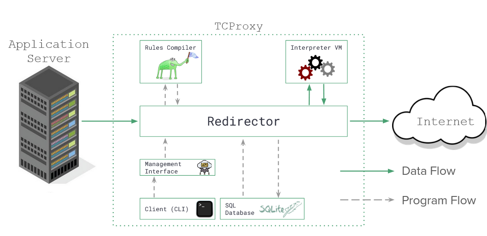

# TCProxy

Team Crab Lang Gang: Ronan Boyarski, Nikhil Date, Ethan Zhang, Somrishi Bannerjee

## Introduction
### What is TCProxy?
TCProxy is a performant reverse proxy written in Rust designed to work primarily at a TCP level instead of HTTP. 
It is designed to be used with internet-exposed TCP applications that cannot be simply placed behind existing HTTP
redirection solutions like Apache & Nginx.

TCProxy includes a command-line interface for administration and a custom domain-specific language used to filter inbound packets. It an operate in two modes: OPAQUE and TRANSPARENT.

OPAQUE mode: filtering cannot be done based on the content of the inbound packet, only on its metadata (such as source and destination). Ideal for when the underlying traffic is already encrypted.

TRANSPARENT mode: filtering can be done based on the content of the packet, and the packet content can be modified by the proxy in transit. This is ideal for when you can decrypt the underlying traffic, and if you need to do something like URL rewriting.

## Technical Architecture



## Installation and Usage Instructions
### Setting up TCProxy
For each of the core components (client and redirector), enter the directory and compile with `cargo build --release`. 
This will build a release version of the binary in the `target/release` directory.

### Running TCProxy
Begin by running the redirector. By default, it logs all output to a log file in the `log` directory to support easy
headless mode. However, you can enable printing to stdout with the `-s` flag. You will need to specify at a minimum the 
local port to listen on, the local IP to bind to, and the destination port (and optionally IP) to redirect to.

For example, if we wanted to start our redirector to redirect all traffic headed to any interface (0.0.0.0) on port 80 to a 127.0.0.1:8000, we could run the following command:
```
./target/release/redirector -b 80 -l 0.0.0.0 -d 8000 -s
```

From here, we could start up our localhost:8000 service, like nginx or a simple python server. Alternatively you could take advantage of the TCP-level abilities and do something like `nc -lvnp 8000`.

The default policy for the redirector is to allow all traffic. If you want to upload a different set of rules, you will need to use the client.
The client will automatically connect to a running redirector on the same machine. From there, you will need to upload a rule file that you wrote. 
Then, you will need to use the `set-program` command by ID. When executed, the server will begin to use the new rule file, with no loss in uptime.
```
./target/release/client
create -n localhost -p rules/localhost.rf
list
set-program 1
```

The rules are saved to disk on a sqlite database, so they will persist across restarts of the redirector. They will not automatically be run, however.

## Developers
- Ronan Boyarski: Initial idea, project design and architecture. Set up the SQLite database, RPC API, TARPC interface, initial filtering logic, and client.
- Nikhil Date: Rule filtering & critical performance improvements, DSL implementation and improvements, VM design and implementation, RPC API
- Ethan Zhang: Implemented most of the rule language, including parsing, codegen, the underlying VM implementation, and compilation
- Somrishi Bannerjee: Helped set up some of the redirector RPC API, SQLite database, and the client
